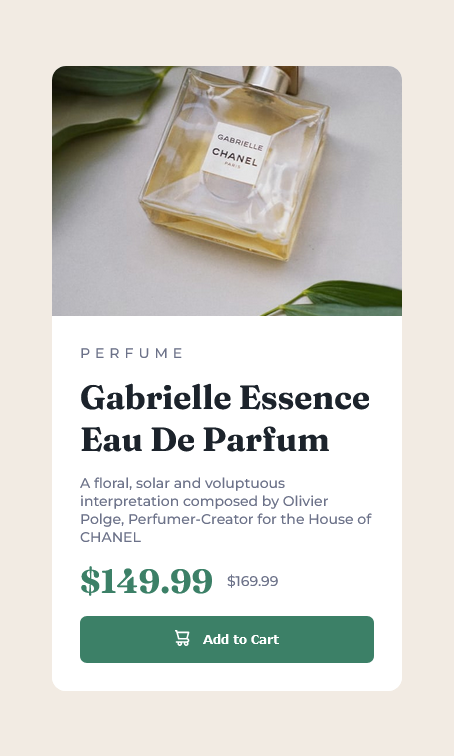

# Frontend Mentor - Product preview card component solution

This is a solution to the [Product preview card component challenge on Frontend Mentor](https://www.frontendmentor.io/challenges/product-preview-card-component-GO7UmttRfa). Frontend Mentor challenges help you improve your coding skills by building realistic projects.

## Table of contents

- [Overview](#overview)
  - [Screenshot](#screenshot)
  - [Links](#links)
- [My process](#my-process)
  - [Built with](#built-with)
  - [What I learned](#what-i-learned)
- [Author](#author)

## Overview

### The challenge

Users should be able to:

- View the optimal layout depending on their device's screen size
- See hover and focus states for interactive elements

### Screenshot




### Links

- Solution URL: [Add solution URL here](https://your-solution-url.com)
- Live Site URL: [Add live site URL here](https://your-live-site-url.com)

## My process

### Built with

- Semantic HTML5 markup
- CSS custom properties
- Flexbox
- CSS Grid
- Mobile-first workflow
- [TypeScript](https://www.typescriptlang.org/)
- [React](https://reactjs.org/) - JS library

### What I learned

fot this project I focused on creating a reusable component. This means that all the text in the component is changeable on the top level on the component. I also included standard texts, so that if nothing is input it does not break the component.

The component is added to the DOM like this

```tsx
<Card
  Image={imageDesk}
  Category="Perfume"
  Title="Gabrielle essence eau de parfum"
  Body="A floral, solar and voluptuous interpretation composed by Olivier Polge, Perfumer-Creator for the House of CHANEL"
  Price="149.99"
  OriginalPrice="169.99"
  buttonText="Add to Cart"
/>
```

If title is not declared it will default to title, the same goes for all other parameters

```tsx
<h1 className={style.Title}>{Title ? Title : "Title"}</h1>
```

## Author

- Website - [Haakon Mydland](https://www.haakonmydland.com/home)
- Frontend Mentor - [@haakonmydland](https://www.frontendmentor.io/profile/haakonmydland)
- Twitter - [@haakonmydland](https://www.twitter.com/haakonmydland)
